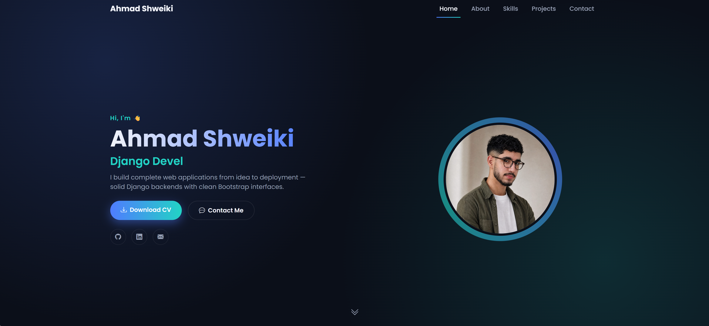

# 🚀 Ahmad Shweiki | Personal Portfolio

A full-stack personal portfolio website built with Django, showcasing my projects, skills, and experience as a Full-Stack Web Developer.

## 🖥️ Live Demo
> Coming soon (not deployed yet)

## 📸 Preview


## ✨ Features
- Fully dynamic content — everything (profile info, skills, projects) is managed through a custom Django admin panel, no code editing required
- Responsive single-page design (Hero, About, Skills, Projects, Contact)
- Animated typing effect and scroll-triggered fade-in animations
- Skill progress bars with category grouping
- Working contact form that saves messages to the database
- Downloadable CV and social links
- Clean dark-themed UI built with Bootstrap 5

## 🛠️ Built With
- **Backend:** Python, Django
- **Database:** SQLite (development) / MySQL-ready
- **Frontend:** HTML5, CSS3, JavaScript, Bootstrap 5
- **Icons:** Bootstrap Icons
- **Other:** Pillow (image handling), python-dotenv (environment variables)

## 📂 Project Structure
```
portfolio/
├── portfolio_project/       # Django project settings
├── portfolio/                # Main app (models, views, admin, templates, static)
│   ├── management/commands/  # Custom seed_data command
│   ├── templates/
│   └── static/
├── media/                    # Uploaded images & CV (not tracked in git)
├── requirements.txt
└── manage.py
```

## ⚙️ Setup & Installation

1. Clone the repository
```
git clone https://github.com/AhmadSHW/Portfolio.git
cd Portfolio
```

2. Create and activate a virtual environment
```
python -m venv venv
venv\Scripts\activate
```

3. Install dependencies
```
pip install -r requirements.txt
```

4. Set up environment variables
```
copy .env.example .env
```

5. Run migrations
```
python manage.py makemigrations
python manage.py migrate
```

6. Create an admin account
```
python manage.py createsuperuser
```

7. (Optional) Seed initial data
```
python manage.py seed_data
```

8. Run the development server
```
python manage.py runserver
```

Visit `http://127.0.0.1:8000/` for the site, and `http://127.0.0.1:8000/admin/` to manage content.

## 📬 Contact

- **Email:** ahmadshwiki780@gmail.com
- **LinkedIn:** [linkedin.com/in/ahmadalshwiki](https://linkedin.com/in/ahmadalshwiki)
- **GitHub:** [github.com/AhmadSHW](https://github.com/AhmadSHW)

---
⭐ If you like this project, feel free to star the repo!
